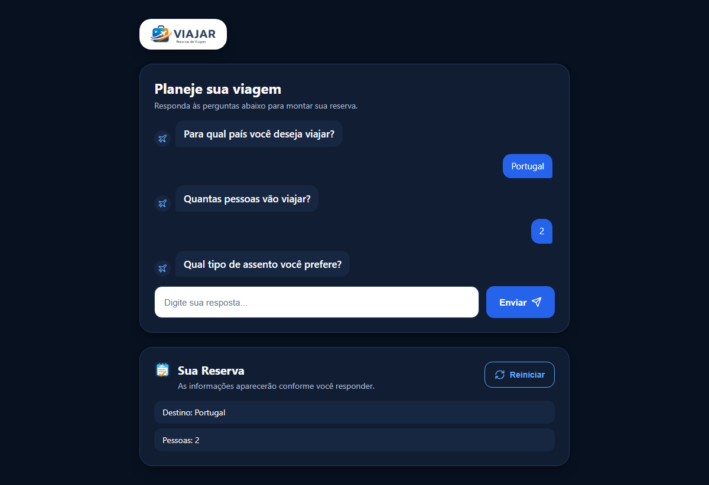

# Travel Agency Chatbot

<p align="center">
  
</p>


[](https://github.com/lianeheidemann/travel-booking-chatbot/actions/workflows/tests.yml)

Simple rule-based chatbot that simulates a travel agency assistant.  
The user is guided through a step-by-step flow to collect booking information and view a live reservation summary.

---

## General Information

This project is a frontend exercise built with JavaScript.

It demonstrates:
- DOM manipulation
- Modular JavaScript 
- Basic input validation using keyword matching
- Simple conversational flow logic

The chatbot collects travel information step by step and updates a reservation summary in real time.

---

## Technologies

- HTML5  
- CSS3  
- JavaScript (ES Modules)
- Vitest (unit tests)
- GitHub Actions (CI)

---

## Features

- Step-by-step conversational flow  
- Keyword-based validation system  
- Live reservation summary  

---

## Tests

Unit tests cover the answer-validation logic (`logic.js`) using [Vitest](https://vitest.dev).

```bash
npm install
npm test
```

A GitHub Actions workflow runs this suite automatically on every push and pull request to `main`.

---

## Screenshots

<p align="center">
  <br>
  <sub>Desktop</sub>
</p>

<p align="center">
  <br>
  <sub>Mobile</sub>
</p>

---

## Demo


---

## Contact

Developed by Liane Heidemann
